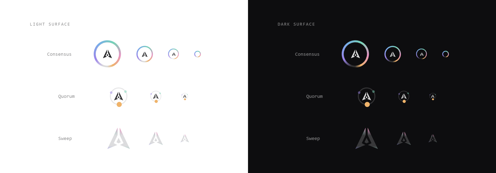

# GenLayer Spinner

An original animated loading spinner for the GenLayer Portal.
Built for **Portal mission 12, Design the GenLayer Spinner**.



**Live demo: https://0xyuura.github.io/genlayer-spinner/**
The spinners on this page are animating. The image above is a still frame.

---

## The idea

A spinner is the single piece of motion a user sees hundreds of times, so it should say something
true about the product rather than just fill time.

GenLayer is the adjudication layer: work goes out, validators reason over it, and a decision comes
back. That is exactly the shape of a loading state. So the spinner is built from two GenLayer
things and nothing else:

1. **The GenLayer mark**, used unmodified. The three original paths are lifted straight from the
   portal, not redrawn or approximated.
2. **The GenLayer Points rainbow**, `#9B83EA → #77AEE9 → #75D4B6 → #E694C4 → #EFB36A`, sampled from
   the live `--glp-rainbow` token on portal.genlayer.foundation.

The arc sweeps the ring while the mark holds the centre, then pulses once at 74% of the cycle as
the arc closes. That single beat is the decision landing. It is small enough that you never
consciously notice it, and it is the reason the loop does not feel mechanical.

No gradients behind the logo, no glow, no bounce, no easter eggs. The restraint is the point:
this thing has to survive being seen a thousand times.

---

## What the brief asked for

| Requirement | How it is met |
| --- | --- |
| Original animated spinner | Drawn from scratch on a 48 unit grid. Nothing traced, no library, no generator. |
| Web ready format | Standalone SVG, pure CSS build, and a React component. Pick one, no build step needed for any of them. |
| Smooth infinite loop | 1.6s cycle. The dash offset ends exactly one circumference behind where it started, so the loop point is mathematically seamless, not cross faded. |
| Works on light and dark | The track and the mark use `currentColor`. One file, both surfaces, no theme switch. |
| Readable at small sizes | Stroke weight is locked to diameter at a fixed ratio. Verified at 96, 64, 48, 32, 24 and 16 px. Below 24px the mark is dropped so the silhouette stays clean. |
| GenLayer identity present | The official mark geometry plus the official GLP palette. Nothing invented. |

---

## Files

```
dist/
  genlayer-spinner.svg           primary, standalone, animates inside an 
  genlayer-spinner-on-dark.svg   same spinner, colours pinned for forced dark surfaces
  genlayer-spinner-quorum.svg    variant, three validators orbit and fire in turn
  genlayer-spinner-sweep.svg     variant, a rainbow band rises through the mark
  genlayer-spinner.css           pure CSS build, one element, no images
  GenLayerSpinner.jsx            React component, scoped ids, no dependencies
index.html                       the demo and spec page
preview/                         rendered proof sheets
```

---

## Usage

### 1. Standalone SVG

```html

```

The animation is CSS declared inside the file, so it runs in an ``, as a `background-image`,
and as a favicon. Colour follows `prefers-color-scheme`.

### 2. Pure CSS

```html
<link rel="stylesheet" href="genlayer-spinner.css">

<span class="gl-spinner" role="status" aria-label="Loading"></span>
<span class="gl-spinner gl-spinner--sm"></span>
<span class="gl-spinner" style="--gl-size:72px; --gl-duration:1.9s"></span>
```

One element, two pseudo elements, no images and no JavaScript. The arc is a conic gradient masked
into a ring, and the mark is `currentColor` painted through an inline SVG mask, which is what lets
a single rule serve both themes.

| Token | Default | Notes |
| --- | --- | --- |
| `--gl-size` | `40px` | Diameter. Everything else scales from it. |
| `--gl-stroke` | `size / 13.3` | Override only if you need a heavier ring. |
| `--gl-duration` | `1.6s` | Lengthen for large hero spinners, not for small ones. |
| `--gl-mark` | `40%` | Mark size relative to the ring. |
| `--gl-c1` ... `--gl-c5` | GLP rainbow | Swap for a single hue if a surface needs it. |

Modifiers: `--sm` (16px), `--md` (24px), `--lg` (64px), `--xl` (96px), `--inline` (matches the
current text size), `--bare` (ring only).

### 3. React

```jsx
import GenLayerSpinner from "./GenLayerSpinner";

<GenLayerSpinner />
<GenLayerSpinner size={16} showMark={false} />
<GenLayerSpinner size={72} duration="1.9s" label="Verifying decision" />
```

Gradient and keyframe names are namespaced with `useId`, so any number of instances can sit on one
page without colliding.

---

## Specification

| Property | Value |
| --- | --- |
| Canvas | 48 x 48 viewBox, centre at 24, 24 |
| Ring | radius 20, stroke 3.6 units, round caps |
| Stroke ratio | diameter / 13.3 |
| Cycle | 1.6s, infinite |
| Rotation easing | `linear` |
| Arc easing | `cubic-bezier(.42, 0, .25, 1)` |
| Mark pulse | `cubic-bezier(.34, 1.4, .5, 1)`, fires at 74% |
| Arc length | 9 to 82 units of a 125.664 circumference |
| Payload | SVG 1.9 KB, CSS 3.4 KB, no runtime, no network requests |

---

## Accessibility

- Every build carries `role="status"` and an `aria-label`, so screen readers announce the wait
  instead of silently skipping it.
- `prefers-reduced-motion: reduce` is honoured in all three builds. Rotation stops and the spinner
  falls back to a static arc with a slow opacity fade, which still communicates "working" without
  vestibular motion.
- Contrast holds on `#FFFFFF` and on `#0D0D0F`. The rainbow carries the state, and the track plus
  mark inherit the surface's own text colour, so it can never end up invisible.

## Browser support

Chrome, Edge, Safari 15.4+, Firefox 53+. The CSS build degrades through a `@supports` guard: if
`mask` is unavailable, the ring falls back to a two colour border spinner rather than disappearing.

### One note on the standalone SVG

An SVG loaded through `` resolves `prefers-color-scheme` against the browser, not against the
surface it sits on. If you place it on a dark panel inside an otherwise light page, set
`color-scheme: dark` on the container and the mark inverts correctly. If you cannot set that, use
`genlayer-spinner-on-dark.svg`, or use the CSS or React build, which follow `currentColor` and are
never wrong.

---

## Variants

| Name | Use it for |
| --- | --- |
| **Consensus** (primary) | Every general loading state. This is the default. |
| **Quorum** | Validator and consensus screens. Three nodes orbit a ring and fire in turn, and the mark brightens once all three have spoken. |
| **Sweep** | First paint and full page transitions. A band of the rainbow rises through the mark on a seamless 2.2s loop. |

---

## Credits

Mark geometry and the GenLayer Points palette belong to GenLayer and are used here to build
something for the GenLayer Portal. Motion design, the CSS and SVG implementation, the demo page and
everything else in this repo are original work for mission 12.

Released under the MIT licence so the Foundation can use, change or ship it without asking.
